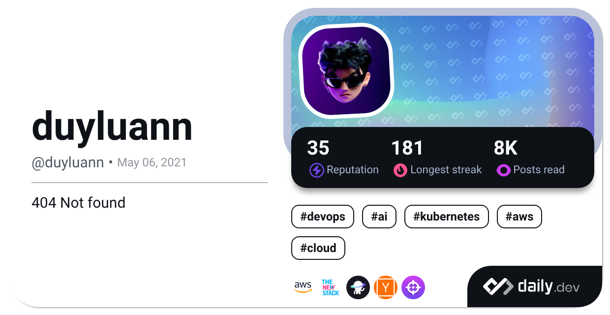

# Hey there! 😊

Welcome to my workspace! I'm Luan, a passionate DevOps Engineer.

## 📚 Education

- Bachelor of Electrical, Electronics and Communications Engineering - Ho Chi Minh University of Technology, 2015-2019

## 🌟 Certifications

- **AWS Certificates**: &nbsp;

## 🛠️ Technologies I'm Proficient With

- **Cloud Platforms**: &nbsp;
  
  

- **Containerization**: &nbsp;
  
  
  
  
  

- **Infrastructure as Code**: &nbsp;
  
  
  

- **CI/CD**: &nbsp;
  
  
  
  
  

- **Monitoring & Logging**: &nbsp;
  
  
  
  
  
  

- **Version Control**: &nbsp;

- **Scripting/Programming**: &nbsp;
  
  

- **Database**: &nbsp;
  
  
  

- **Code Quality and Analysis**: &nbsp;
  

 

 

## 📫 Contact Me

- LinkedIn: [Nguyen Duy Luan](https://www.linkedin.com/in/duyluan97/)
- Email: duyluan0607@gmail.com
- GitHub: [duyluan97](https://github.com/duyluan97)

⭐️ From [duyluan97](https://github.com/duyluan97) with luv ❤

