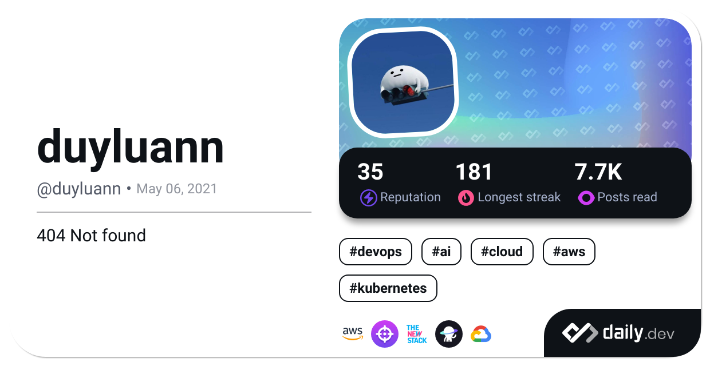

# Hey there! 😊

I'm Luan, a passionate and results-driven DevOps Engineer with a strong background in automating, optimizing, and streamlining software development and IT operations. I am committed to enhancing collaboration between development and operations teams to accelerate software delivery, improve reliability, and ensure scalability.

## 📚 Education

- Bachelor of Electrical, Electronics and Communications Engineering - Ho Chi Minh University of Technology, 2015-2019

## 🌟 Certifications

- **AWS Certificates**: &nbsp;

## 🛠️ Technologies I'm Proficient With

- **Cloud Platforms**: &nbsp;
  
  

- **Containerization**: &nbsp;
  

- **Infrastructure as Code**: &nbsp;
  
  

- **CI/CD**: &nbsp;
  
  
    
    

- **Monitoring & Logging**: &nbsp;
  
  
  
  

- **Version Control**: &nbsp; 

- **Scripting/Programming**: &nbsp;
  
  

- **Database**: &nbsp;
  
  
  

- **Code Quality and Analysis**: &nbsp;
  

 

 

## 📫 Contact Me

- LinkedIn: [Nguyen Duy Luan](https://www.linkedin.com/in/duyluan97/)
- Email: duyluan0607@gmail.com
- GitHub: [duyl97](https://github.com/duyl97)

I am passionate about driving innovation, optimizing processes, and enabling teams to achieve their full potential through DevOps practices. If you're looking to enhance your software delivery pipeline, improve infrastructure reliability, or simply want to connect and discuss all things DevOps, feel free to reach out!

⭐️ From [duyl97](https://github.com/duyl97) with luv ❤

